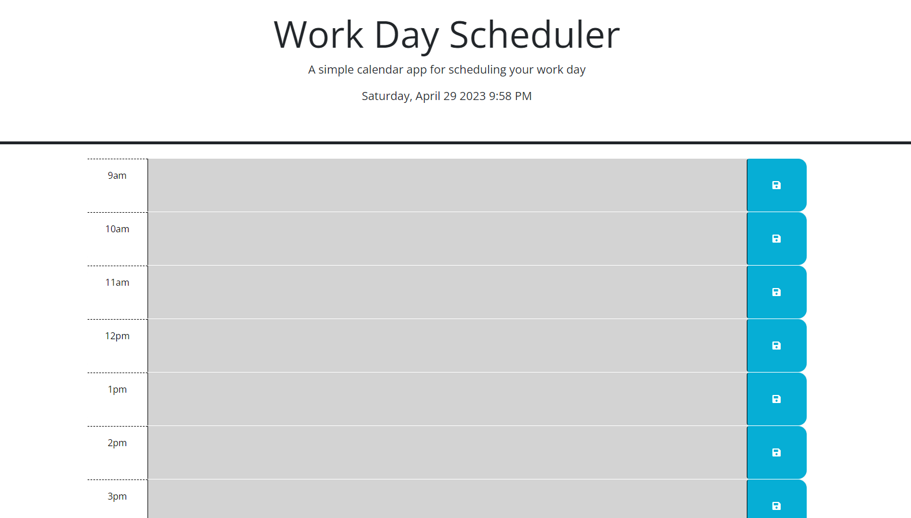
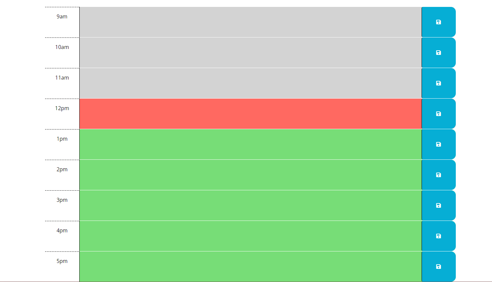
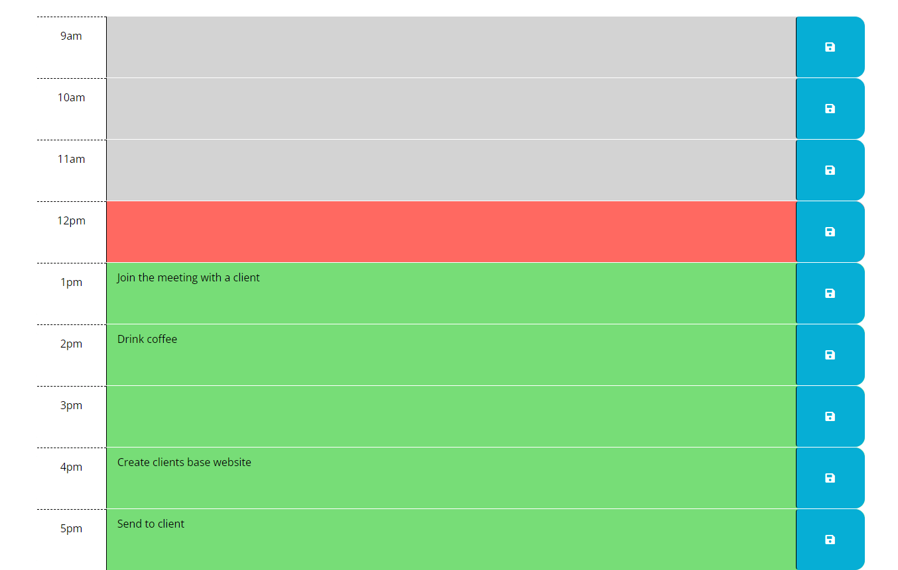

# JQuery-Work-Day-Scheduler

## Git Page
[Link to page](https://amillsy.github.io/JQuery-Work-Day-Scheduler/)
## User Story

```md
AS AN employee with a busy schedule
I WANT to add important events to a daily planner
SO THAT I can manage my time effectively
```

## Acceptance Criteria

```md
GIVEN I am using a daily planner to create a schedule
WHEN I open the planner
THEN the current day is displayed at the top of the calendar
WHEN I scroll down
THEN I am presented with timeblocks for standard business hours
WHEN I view the timeblocks for that day
THEN each timeblock is color coded to indicate whether it is in the past, present, or future
WHEN I click into a timeblock
THEN I can enter an event
WHEN I click the save button for that timeblock
THEN the text for that event is saved in local storage
WHEN I refresh the page
THEN the saved events persist
```

## What I have learnt

The purpose of this week was the use of Third party API's. The first API to take note of is JQuery, the reason for learning an old and almost outdated library is because in the work place, I could run into code that uses this great library in the work place. Secondly, a CSS library called bootstrap is also used in this project but not that promiment in this weeks developement but it has showcased the speed you have when trying to quickly make a template of a website.

The main skill that I learnt this week is the ability to quickly skim and interperate the libraries document as they aren't using basic JavaScript syntax and have there own way, so going through document made me realise that it is a skill to be able to understand and then use functions that have been developed by other people. In a real world scenario I will be using document to develop projects, so doing this has helped my understanding and how I should direct myself around documentation. 

## Usage

A user is able to enter in events in each time slot and then save that to local storage so that they could view later in the day.

### Start screen
First the user would enter the website and it would show the time.



### Time blocks
Then below it show the which times are in the future, present and past. In this example I forced it to be midday.



### Adding Events
The user is able to enter data into each timeslot and then save it with the button next to the event and it will persist until deletion.

